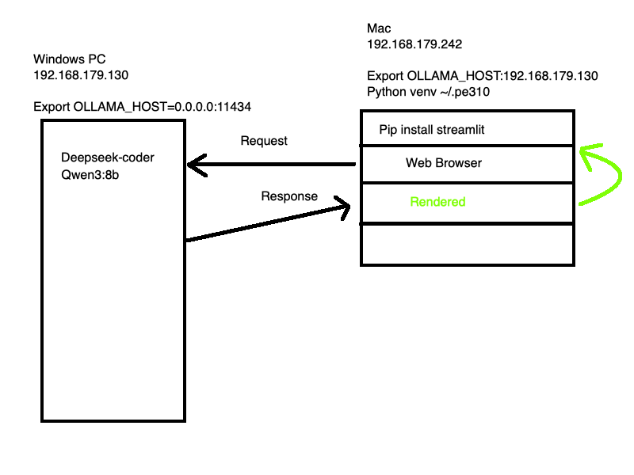

# Local LLM and how to access it - in a WebUI manner 

I have installed **OLLAMA**, and added a few models, both on Windows and on a Mac.

My Windows machine has a nice fat GPU in it - the mac does not.
My Windows machine does very little when  I am programming, the Mac is my workhorse.

So I chose to install **OLLAMA** on the Windows - so I can expirement with LLMs.

But I now want to query this LLM from my Mac - without installing Docker, Open-Ui, npm and a host of other stuff.

Something like this




## Software 

We are going to use my VirtualPython env pe310 (which already exists)

    pe310 
    pip install Streamlit
    
## Create a Run Script 

```bash
#!/bin/bash
# On the MAC we SHOULD NOT be running ollama
echo "Setting Remote OLLAMA Host "
#
# A Windows PC is running OLLAMA it has had its
# env setting set to OLLAMA_HOST=0.0.0.0:11434
# So it is listening on all interfaces
#
export OLLAMA_HOST="http://192.168.179.130:11434"
echo "Activating python venv 3.10"
source ~/.pe310/bin/activate
# We run our small Python code 
streamlit run mychat.py mychat.py --server.address 0.0.0.0 --server.port 8501
```

This is the **python** code called **mychat.py**

## MyChat.py 

```python
import streamlit as st
import requests
import json
import os

OLLAMA = os.getenv("OLLAMA_HOST", "http://localhost:11434")
MODEL="deepseek-coder"
st.title(f"Ollama Chat {MODEL}")

prompt = st.text_area("HAL:")

if st.button("Send"):
    with requests.post(
        f"{OLLAMA}/api/generate",
        json={"model": MODEL, "prompt": prompt, "stream": True},
        stream=True
    ) as r:
        output = ""
        box = st.empty()
        for line in r.iter_lines():
            if line:
                data = json.loads(line)
                output += data.get("response", "")
                box.markdown(output)
```

# Why host the web interface on the Mac ?

Actually this is a good question.... You could move the Web Service (streamlit) to the Windows PC also. That would make sense.

